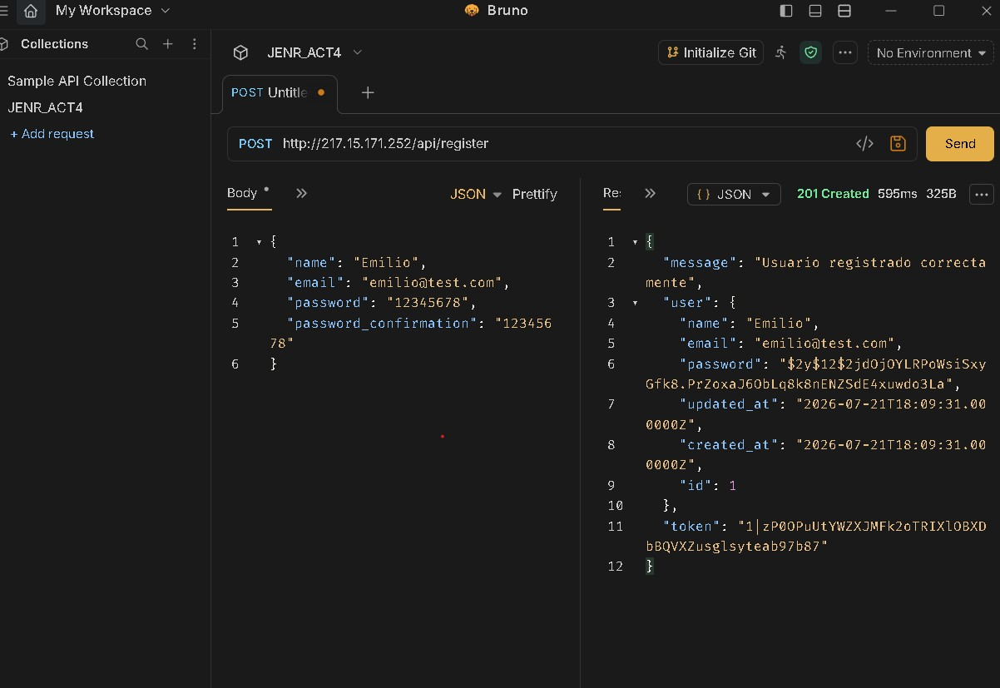
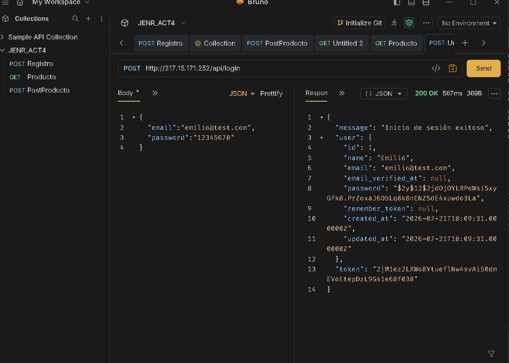
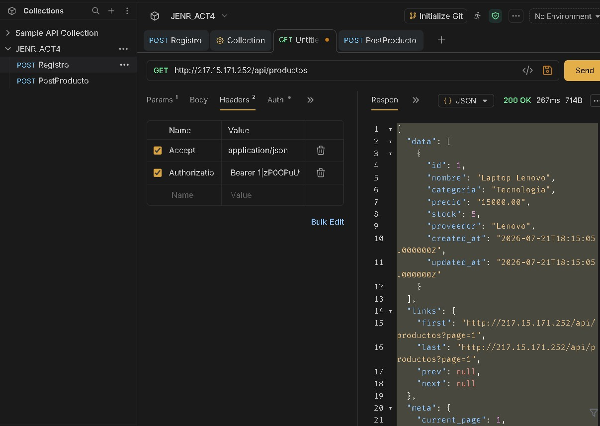
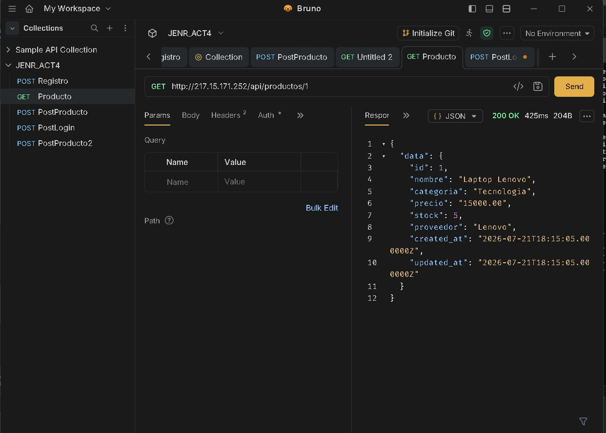
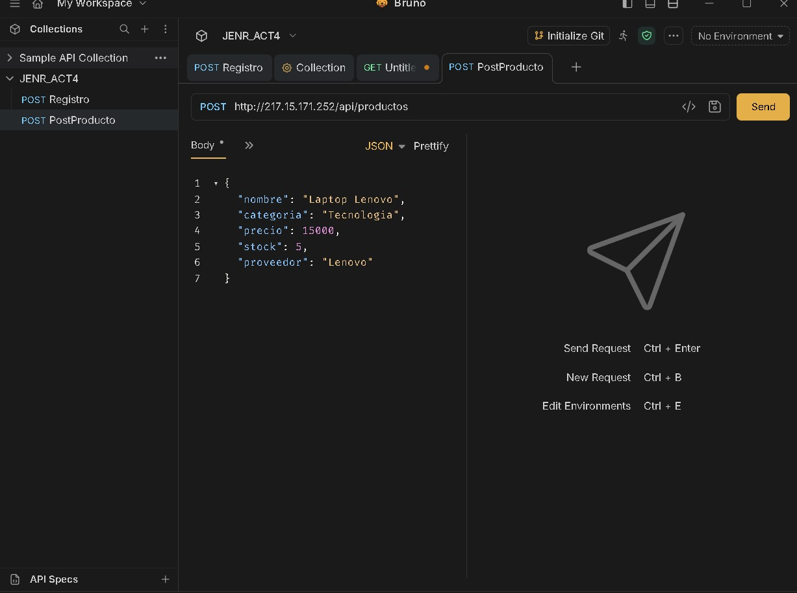
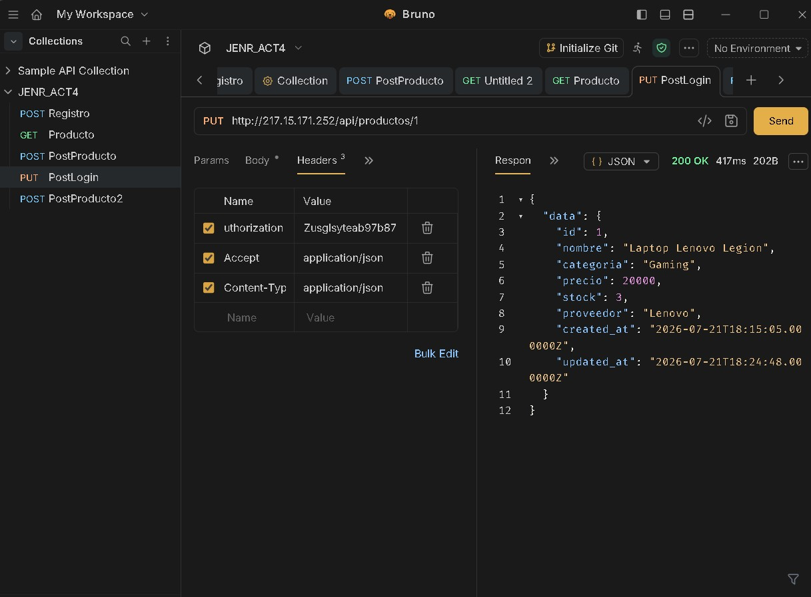
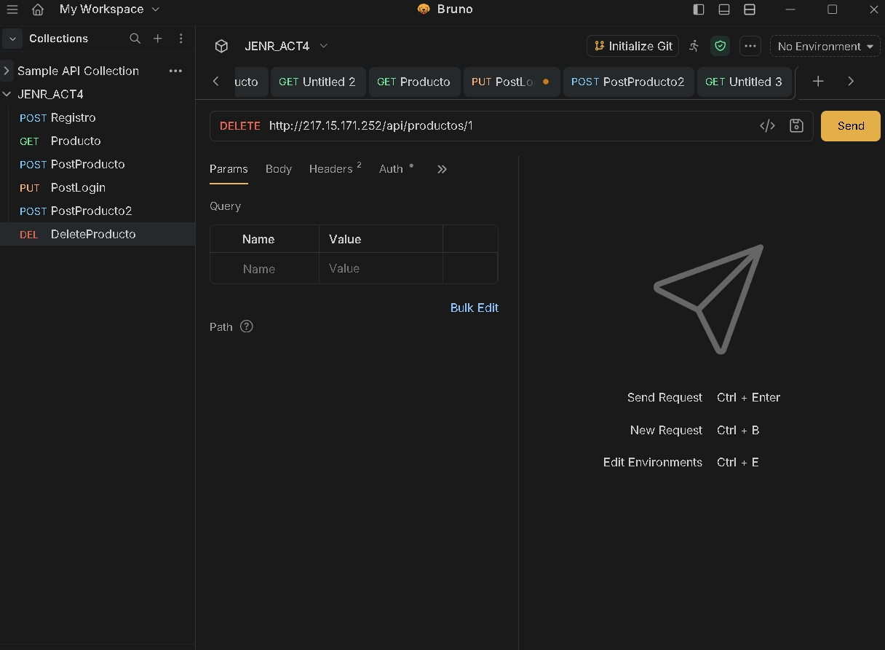

# Actividad 4 - API REST con Laravel 12, Sanctum y CRUD

## Alumno

**Jorge Emilio Núñez Reyes**

## Repositorio

https://github.com/emilioreyes2219/JENRact4_t4

---

# Descripción

Este proyecto consiste en el desarrollo de una API REST utilizando **Laravel 12** y **Laravel Sanctum** para la autenticación mediante tokens.

La aplicación permite el registro e inicio de sesión de usuarios y la administración de productos mediante un CRUD completo. El proyecto fue desplegado en un VPS con Ubuntu utilizando Nginx y MySQL como servidor de base de datos.

---

# Tecnologías utilizadas

- Laravel 12
- PHP 8.3
- Laravel Sanctum
- MySQL
- Nginx
- Composer
- Git y GitHub
- Bruno (para pruebas de la API)
- Ubuntu VPS

---

# Base de datos

Nombre de la base de datos:

```
act4_api
```

Tabla principal:

```
productos
```

Campos:

| Campo | Tipo |
|--------|------|
| id | bigint |
| nombre | string |
| categoria | string |
| precio | decimal |
| stock | integer |
| proveedor | string |

---

# Autenticación

La autenticación se realiza mediante **Laravel Sanctum**, utilizando tokens Bearer.

Después de iniciar sesión, el token obtenido debe enviarse en el encabezado:

```
Authorization: Bearer 1|zP0OPuUtYWZXJMFk2oTRIXlOBXDbBQVXZusglsyteab97b87
```

---


# Endpoints de la API

## Registro

**POST**

```
/api/register
```

Body

```json
{
    "name":"Emilio",
    "email":"emilio@test.com",
    "password":"12345678",
    "password_confirmation":"12345678"
}
```

### Evidencia



---

## Login

**POST**

```
/api/login
```

Body

```json
{
    "email":"emilio@test.com",
    "password":"12345678"
}
```

### Evidencia



---

## Obtener productos

**GET**

```
/api/productos
```

### Evidencia



---

## Obtener un producto

**GET**

```
/api/productos/{id}
```

### Evidencia



---

## Crear producto

**POST**

```
/api/productos
```

Body

```json
{
    "nombre":"Laptop Lenovo",
    "categoria":"Tecnologia",
    "precio":15000,
    "stock":5,
    "proveedor":"Lenovo"
}
```

### Evidencia



---

## Actualizar producto

**PUT**

```
/api/productos/{id}
```

Body

```json
{
    "nombre":"Laptop Lenovo Legion",
    "categoria":"Gaming",
    "precio":20000,
    "stock":3,
    "proveedor":"Lenovo"
}
```

### Evidencia



---

## Eliminar producto

**DELETE**

```
/api/productos/{id}
```

### Evidencia



---

# Instalación

Clonar el repositorio

```bash
git clone https://github.com/emilioreyes2219/JENRact4_t4.git
```

Entrar al proyecto

```bash
cd JENRact4_t4
```

Instalar dependencias

```bash
composer install
```

Copiar el archivo de entorno

```bash
cp .env.example .env
```

Generar la llave

```bash
php artisan key:generate
```

Ejecutar migraciones

```bash
php artisan migrate
```

Iniciar el servidor

```bash
php artisan serve
```

---

# Funcionalidades

- Registro de usuarios
- Inicio de sesión
- Autenticación mediante Laravel Sanctum
- CRUD completo de productos
- Validación de datos
- Paginación de productos
- API REST
- Despliegue en VPS

---

# Autor

**Jorge Emilio Núñez Reyes**

Programación Web